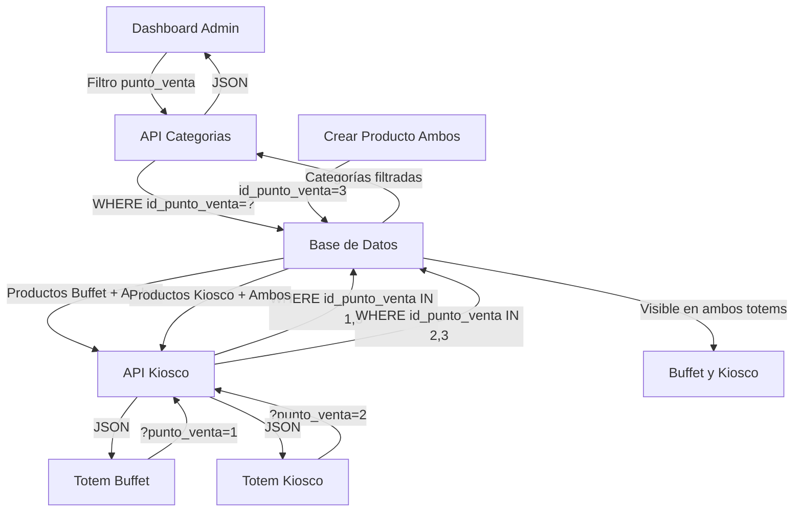

# Sistema de Categorías Separadas por Punto de Venta

## 📋 Descripción General

El sistema ahora soporta **categorías independientes** para cada punto de venta (Buffet, Kiosco y Ambos), permitiendo una gestión más flexible y específica de los productos en cada área.

### ⭐ Nuevo: Punto de Venta "Ambos"

Ahora existe un tercer punto de venta llamado **"Ambos" (id=3)** que permite que un producto aparezca simultáneamente en el Buffet y en el Kiosco sin necesidad de duplicarlo. Esto es ideal para productos comunes en ambos lugares.

---

## 🏗️ Arquitectura

### **Base de Datos**

#### Tabla `categorias` - Cambios implementados:
```sql
ALTER TABLE categorias 
ADD COLUMN id_punto_venta TINYINT NOT NULL DEFAULT 1 AFTER orden,
ADD CONSTRAINT fk_categorias_punto_venta 
    FOREIGN KEY (id_punto_venta) REFERENCES puntos_venta(id_punto_venta);
```

**Columnas relevantes:**
- `id_categoria` (INT, PK)
- `nombre` (VARCHAR 100)
- `descripcion` (VARCHAR 255)
- `icono` (VARCHAR 255) - Nombre del archivo SVG
- `color` (VARCHAR 7)
- `visible` (TINYINT 1/0)
- `orden` (TINYINT)
- **`id_punto_venta` (TINYINT, FK)** - ⭐ NUEVA
- `creado_en` (DATETIME)
- `modificado_en` (DATETIME)
- `eliminado` (TINYINT)

#### Tabla `puntos_venta`:
- **id_punto_venta = 1** → Buffet
- **id_punto_venta = 2** → Kiosco
- **id_punto_venta = 3** → Ambos ⭐ NUEVO

---

## 🔧 Implementación Backend

### **1. API de Administración** (`backend/admin/api/api_categorias.php`)

#### **GET - Listar categorías**
```http
GET /api_categorias.php?action=list
GET /api_categorias.php?action=list&punto_venta=1  # Solo Buffet
GET /api_categorias.php?action=list&punto_venta=2  # Solo Kiosco
GET /api_categorias.php?action=list&include_inactive=true
```

**Respuesta:**
```json
{
  "success": true,
  "categorias": [
    {
      "id_categoria": 10,
      "nombre": "Snacks",
      "descripcion": "",
      "icono": "Icono_Snacks.svg",
      "color": "#3B82F6",
      "visible": 1,
      "orden": 1,
      "id_punto_venta": 2,
      "punto_venta_nombre": "Kiosco",
      "total_productos": 5,
      "creado_en": "2025-02-02 14:30:00",
      "modificado_en": "2025-02-02 14:30:00"
    }
  ]
}
```

#### **GET - Estadísticas**
```http
GET /api_categorias.php?action=stats
GET /api_categorias.php?action=stats&punto_venta=1
```

**Respuesta:**
```json
{
  "success": true,
  "stats": {
    "total": 9,
    "activas": 9,
    "inactivas": 0
  }
}
```

#### **POST - Crear categoría**
```json
{
  "nombre": "Postres",
  "descripcion": "Postres y dulces",
  "icono": "Icono_Postres.svg",
  "color": "#F59E0B",
  "visible": true,
  "id_punto_venta": 1  // ⚠️ REQUERIDO
}
```

#### **PUT - Actualizar categoría**
```json
{
  "id_categoria": 10,
  "nombre": "Snacks Saludables",
  "descripcion": "Opciones saludables",
  "icono": "Icono_Snacks.svg",
  "color": "#10B981",
  "visible": true,
  "id_punto_venta": 2  // Opcional (mantiene el actual si no se envía)
}
```

---

### **2. API de Kiosco/Buffet** (`backend/api/api_kiosco.php`)

#### **GET - Productos y categorías para totem**
```http
GET /api_kiosco.php?punto_venta=1  # Buffet
GET /api_kiosco.php?punto_venta=2  # Kiosco
```

**Filtrado automático:**
- Las categorías se filtran por `id_punto_venta`
- Los productos se filtran por: `WHERE id_punto_venta IN (punto_venta_solicitado, 3)`
  - **Buffet (id=1)**: Trae productos con `id_punto_venta IN (1, 3)` - productos de Buffet + Ambos
  - **Kiosco (id=2)**: Trae productos con `id_punto_venta IN (2, 3)` - productos de Kiosco + Ambos
- Solo se devuelven categorías visibles (`visible = 1`)
- Los productos con `id_punto_venta=3` ("Ambos") aparecen automáticamente en ambos totems

#### **GET - Lista de categorías (action)**
```http
GET /api_kiosco.php?action=categorias
GET /api_kiosco.php?action=categorias&punto_venta=2
```

---

## 🎨 Implementación Frontend

### **1. Dashboard de Administración** (`frontend/views/ConfigDash.html`)

#### **Filtro por Punto de Venta**
```html
<select id="filtro-punto-venta" class="filtro-select">
    <option value="">Todos los puntos de venta</option>
    <option value="1">Buffet</option>
    <option value="2">Kiosco</option>
    <option value="3">Ambos</option> <!-- ⭐ NUEVO -->
</select>
```

#### **Campo en Formulario**
```html
<div class="form-group">
    <label for="categoria-punto-venta">Punto de Venta *</label>
    <select id="categoria-punto-venta" name="id_punto_venta" required>
        <option value="">Seleccione...</option>
        <option value="1">Buffet</option>
        <option value="2">Kiosco</option>
        <option value="3">Ambos</option> <!-- ⭐ NUEVO -->
    </select>
</div>
```

#### **Columna en Lista**
```html
<div class="categorias-lista-header">
    <div class="col-nombre">Nombre</div>
    <div class="col-punto-venta">Punto de Venta</div>  <!-- NUEVA -->
    <div class="col-productos">Productos</div>
    <div class="col-estado">Estado</div>
    <div class="col-acciones">Acciones</div>
</div>
```

**Renderizado visual:**
```html
<span style="background-color: #10b98122; color: #10b981; padding: 4px 12px; border-radius: 12px;">
    Buffet
</span>
<!-- o -->
<span style="background-color: #3b82f622; color: #3b82f6; padding: 4px 12px; border-radius: 12px;">
    Kiosco
</span>
<!-- o ⭐ NUEVO -->
<span style="background-color: #9c27b022; color: #9c27b0; padding: 4px 12px; border-radius: 12px;">
    Ambos
</span>
```

---

### **2. JavaScript del Dashboard** (`frontend/assets/js/dashboard/categorias.js`)

#### **Carga con filtro**
```javascript
async cargarCategorias() {
    const includeInactive = document.getElementById('mostrar-categorias-inactivas')?.checked || false;
    const filtroPuntoVenta = document.getElementById('filtro-punto-venta')?.value || '';
    
    let url = `/Totem_Murialdo/backend/admin/api/api_categorias.php?action=list&include_inactive=${includeInactive}`;
    if (filtroPuntoVenta) {
        url += `&punto_venta=${filtroPuntoVenta}`;
    }
    
    const response = await fetch(url);
    const data = await response.json();
    
    if (data.success) {
        this.categorias = data.categorias;
        this.renderCategorias();
    }
}
```

#### **Validación en formulario**
```javascript
async guardarCategoria() {
    const data = {
        id_categoria: formData.get('id_categoria') || null,
        nombre: formData.get('nombre').trim(),
        descripcion: formData.get('descripcion').trim(),
        icono: formData.get('icono'),
        visible: formData.has('visible'),
        id_punto_venta: parseInt(formData.get('id_punto_venta')) || null
    };

    if (!data.nombre) {
        this.mostrarError('El nombre es requerido');
        return;
    }

    if (!data.id_punto_venta) {
        this.mostrarError('El punto de venta es requerido');
        return;
    }
    
    // ... resto del código
}
```

---

### **3. Frontend del Totem**

#### **Buffet** (`frontend/assets/js/buffet.js`)
```javascript
const API_URL = '/Totem_Murialdo/backend/api/api_kiosco.php?punto_venta=1'; // Filtrar por Buffet
const PUNTO_VENTA_ID = 1;
const PUNTO_VENTA_NOMBRE = 'Buffet';
```

#### **Kiosco** (`frontend/assets/js/kiosco_dinamico.js`)
```javascript
const API_URL = '/Totem_Murialdo/backend/api/api_kiosco.php?punto_venta=2'; // Filtrar por Kiosco
const PUNTO_VENTA_ID = 2;
const PUNTO_VENTA_NOMBRE = 'Kiosco';
```

**Ambos scripts:**
- Establecen el punto de venta en `localStorage`
- Filtran automáticamente las categorías
- Solo muestran productos de su punto de venta

---

## 📊 Estado Actual de Datos

### **Puntos de Venta Disponibles**

| id_punto_venta | nombre | descripción |
|----------------|--------|-------------|
| 1 | Buffet | Productos exclusivos del Buffet |
| 2 | Kiosco | Productos exclusivos del Kiosco |
| 3 | Ambos ⭐ | Productos que aparecen en Buffet y Kiosco |

### **Categorías en Base de Datos**

| id_categoria | nombre | id_punto_venta | punto_venta | productos |
|--------------|--------|----------------|-------------|-----------|
| 1 | Snacks | 1 | Buffet | X |
| 2 | Bebidas | 1 | Buffet | X |
| 3 | Dulces | 1 | Buffet | X |
| 4 | Postres | 1 | Buffet | X |
| 5 | Comida Caliente | 1 | Buffet | X |
| 6 | Ensaladas | 1 | Buffet | X |
| 7 | Sandwiches | 1 | Buffet | X |
| 8 | Frutas | 1 | Buffet | X |
| 9 | Otros | 1 | Buffet | X |
| 10 | Snacks | 2 | Kiosco | X |
| 11 | Bebidas | 2 | Kiosco | X |
| 12 | Dulces | 2 | Kiosco | X |
| 13 | Postres | 2 | Kiosco | X |
| 14 | Comida Caliente | 2 | Kiosco | X |
| 15 | Ensaladas | 2 | Kiosco | X |
| 16 | Sandwiches | 2 | Kiosco | X |
| 17 | Frutas | 2 | Kiosco | X |
| 18 | Otros | 2 | Kiosco | X |

**Total:** 18 categorías (9 por cada punto de venta)
**Nota:** Los productos con `id_punto_venta=3` pueden usar categorías de Buffet o Kiosco

---

## 🔄 Flujo de Datos



### **Comportamiento de Productos "Ambos"**

1. **Al crear un producto con `id_punto_venta=3`:**
   - Se guarda una sola vez en la base de datos
   - Aparece automáticamente en el totem del Buffet
   - Aparece automáticamente en el totem del Kiosco
   - Se muestra con badge morado en el dashboard

2. **Al consultar productos desde los totems:**
   - Buffet trae: `WHERE id_punto_venta IN (1, 3)`
   - Kiosco trae: `WHERE id_punto_venta IN (2, 3)`
   
3. **Estadísticas:**
   - Un producto "Ambos" vendido en el Buffet cuenta para el Buffet
   - Un producto "Ambos" vendido en el Kiosco cuenta para el Kiosco
   - El pedido mantiene su `id_punto_venta` original (1 o 2)

---

## ✅ Validaciones Implementadas

### **Backend**
1. ✅ `id_punto_venta` es requerido al crear nueva categoría
2. ✅ No se permite nombre duplicado dentro del **mismo** punto de venta
3. ✅ Los productos solo se cuentan dentro de su punto de venta
4. ✅ Constraint FK garantiza integridad referencial

### **Frontend**
1. ✅ Campo "Punto de Venta" es requerido en formulario
2. ✅ Filtro por punto de venta actualiza lista y estadísticas
3. ✅ Badge visual distingue Buffet (verde) de Kiosco (azul)
4. ✅ Validación JavaScript previene envío sin punto de venta

---

## 🧪 Pruebas Sugeridas

### **1. CRUD de Categorías**
- [ ] Crear nueva categoría para Buffet
- [ ] Crear nueva categoría para Kiosco
- [ ] Editar categoría y cambiar de punto de venta
- [ ] Verificar que no se permita nombre duplicado en el mismo punto de venta
- [ ] Verificar que SÍ se permita nombre duplicado en diferente punto de venta
- [ ] Eliminar categoría sin productos
- [ ] Intentar eliminar categoría con productos (debe fallar)

### **2. Filtrado en Dashboard**
- [ ] Filtrar solo Buffet → debe mostrar 9 categorías
- [ ] Filtrar solo Kiosco → debe mostrar 9 categorías
- [ ] Mostrar todos → debe mostrar 18 categorías
- [ ] Verificar que estadísticas cambien según filtro

### **3. Totem Buffet**
- [ ] Verificar que solo aparezcan categorías con `id_punto_venta=1`
- [ ] Verificar que solo aparezcan productos de esas categorías
- [ ] Agregar producto al carrito y confirmar que se guarda correctamente

### **4. Totem Kiosco**
- [ ] Verificar que solo aparezcan categorías con `id_punto_venta=2`
- [ ] Verificar que solo aparezcan productos de esas categorías
- [ ] Agregar producto al carrito y confirmar que se guarda correctamente

### **5. Integridad de Datos**
- [ ] Crear producto en categoría de Buffet → debe aparecer solo en Buffet
- [ ] Crear producto en categoría de Kiosco → debe aparecer solo en Kiosco
- [ ] Cambiar producto de categoría dentro del mismo punto de venta
- [ ] Verificar que el contador de productos se actualice correctamente

---

## 🚀 Próximas Mejoras (Opcionales)

1. **Exportar/Importar categorías** por punto de venta
2. **Duplicar categoría** de un punto de venta a otro
3. **Dashboard comparativo** entre Buffet y Kiosco
4. **Reportes por punto de venta**
5. **Migración masiva** de productos entre puntos de venta

---

## 📝 Notas Importantes

- ⚠️ Al crear una categoría, **siempre** debe especificarse el punto de venta (1, 2 o 3)
- ⚠️ Los iconos SVG son compartidos entre puntos de venta (misma carpeta)
- ⚠️ El orden de categorías es independiente por punto de venta
- ⚠️ No se puede eliminar una categoría con productos asociados
- ⚠️ El mismo nombre puede existir en Buffet, Kiosco y Ambos sin conflicto
- ⭐ Los productos "Ambos" evitan duplicación de datos
- ⭐ Los productos "Ambos" pueden pertenecer a cualquier categoría de Buffet o Kiosco
- ⭐ Badge morado (#9c27b0) identifica visualmente productos "Ambos"

---

## 🐛 Resolución de Problemas

### **Problema: No se muestran categorías en el totem**
- Verificar que el parámetro `?punto_venta=X` esté en la URL
- Verificar que las categorías tengan `visible=1`
- Revisar consola del navegador por errores de red

### **Problema: No se pueden crear categorías sin punto de venta**
- Es el comportamiento esperado
- Seleccionar Buffet o Kiosco en el formulario

### **Problema: Estadísticas incorrectas**
- Verificar que el filtro de punto de venta esté aplicado correctamente
- Limpiar caché del navegador
- Recargar la lista de categorías

---

## 📅 Historial de Cambios

| Fecha | Cambio | Archivo |
|-------|--------|---------|
| 2025-02-02 | Agregada columna `id_punto_venta` | `backend/sql/separar_categorias_por_punto_venta.sql` |
| 2025-02-02 | Actualizada API de categorías | `backend/admin/api/api_categorias.php` |
| 2025-02-02 | Actualizada API de kiosco | `backend/api/api_kiosco.php` |
| 2025-02-02 | Agregado filtro en dashboard | `frontend/views/ConfigDash.html` |
| 2025-02-02 | Actualizado gestor de categorías | `frontend/assets/js/dashboard/categorias.js` |

---

## 👥 Mantenimiento

Para mantener el sistema:
1. Siempre especificar `id_punto_venta` al crear categorías
2. Verificar que los productos estén asignados a categorías del mismo punto de venta
3. Revisar periódicamente categorías sin productos
4. Mantener sincronizados los iconos entre puntos de venta
5. Usar "Ambos" para productos realmente comunes en ambos lugares
6. Revisar periódicamente si productos duplicados pueden convertirse en "Ambos"

---

## 🎯 Guía de Uso del Punto de Venta "Ambos"

### **¿Cuándo usar "Ambos"?**

✅ **SÍ usar "Ambos" para:**
- Bebidas populares (Coca-Cola, Sprite, Agua, etc.)
- Snacks básicos que se venden en ambos lugares
- Productos de marca que están en Buffet y Kiosco
- Cualquier artículo que sea exactamente igual en ambos puntos

❌ **NO usar "Ambos" para:**
- Comidas preparadas específicas de cada lugar
- Productos con precios diferentes según el punto de venta
- Artículos de menú exclusivos de Buffet o Kiosco

### **¿Cómo migrar productos existentes a "Ambos"?**

Si tienes productos duplicados (ejemplo: Coca-Cola en Buffet y Kiosco), puedes:

1. **Identificar productos duplicados:**
   ```sql
   SELECT p1.nombre, p1.id_producto as id_buffet, p2.id_producto as id_kiosco
   FROM productos p1
   JOIN productos p2 ON p1.nombre = p2.nombre
   WHERE p1.id_punto_venta = 1 
   AND p2.id_punto_venta = 2
   AND p1.precio_venta = p2.precio_venta;
   ```

2. **Mantener uno y cambiar a "Ambos":**
   ```sql
   UPDATE productos 
   SET id_punto_venta = 3 
   WHERE id_producto = <ID_DEL_PRODUCTO_A_MANTENER>;
   ```

3. **Eliminar el duplicado:**
   ```sql
   DELETE FROM productos 
   WHERE id_producto = <ID_DEL_PRODUCTO_DUPLICADO>;
   ```

### **Ejemplo Práctico**

**Antes:**
- Producto ID 4: "Coca Cola 500ml" → Punto de Venta: Kiosco
- Producto ID 13: "Coca Cola 500ml" → Punto de Venta: Buffet

**Después:**
- Producto ID 4: "Coca Cola 500ml" → Punto de Venta: **Ambos**
- Producto ID 13: **ELIMINADO**

**Resultado:**
- El producto aparece en ambos totems
- Sin duplicación en la base de datos
- Estadísticas correctas por punto de venta
- Gestión simplificada en el dashboard

### **Visualización en el Dashboard**

Los productos "Ambos" se identifican con:
- 🟣 Badge morado con el texto "Ambos"
- Aparecen al filtrar por "Ambos" en el dashboard
- Aparecen al filtrar por "Todos los puntos de venta"
- NO aparecen al filtrar solo por "Buffet" o solo por "Kiosco"

---

**Documentación generada:** 30/10/2025  
**Versión:** 2.0 - Punto de Venta "Ambos"  
**Autor:** Sistema de Totem Murialdo
